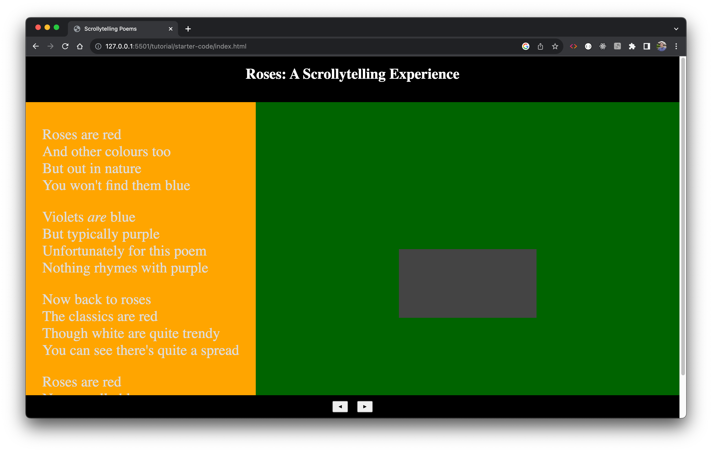

# HW 4: Implement a Scrollytelling Experience

In this homework you will implement a scrolly-telling experience where a user can click through a poem and have their attention drawn to specific parts whilst having related visualisations display and animate throughout the process.

## Starter Code

You will be given a significant amount of starter code in this tutorial especially to deal with the formatting and display of the web page. When you load the tutorial starter code initially it should display a web page that looks like this:



I encourage you to read over the starter code in depth and familiarise yourself with how it works. In particular spend some time playing around with the CSS file and read the comments in this file to understand how this achieves the layout that you begin with.

The header of this page holds the title of the exprerience: _Roses: A Scrollytelling Experience_. The left hand, orange, panel holds the poem that we are displaying, and the right hadn dark green panel will eventually hold the visualisations that we want to associate with the poem. The footer of the page contains two buttons a forward button and a backward button. In a more complete scrollytelling experience you would want to bind the behaviour we will code to these buttons to the scrollwheel of the user, but in our example we will just work with these buttons.

## Scrollytelling - Updating the Text

As you can see in the starter code we have a poem that is being displayed utilising the approach we demonstrated in the first homework using \<ul elements to represent the verses and \li elements within each \<ul> to hold the lines of the verses:

```html
<ul class="verse" id="verse1">
  <li class="line" id="line1">Roses are red</li>
  <li class="line" id="line2">And other colours too</li>
  <li class="line" id="line3">But out in nature</li>
  <li class="line" id="line4">You won't find them blue</li>
</ul>

<ul class="verse" id="verse2">
  <li class="line" id="line1">Violets <em>are</em> blue</li>
  <li class="line" id="line2">But typically purple</li>
  <li class="line" id="line3">Unfortunately for this poem</li>
  <li class="line" id="line4">Nothing rhymes with purple</li>
</ul>

<ul class="verse" id="verse3">
  <li class="line" id="line1">Now back to roses</li>
  <li class="line" id="line2">The classics are red</li>
  <li class="line" id="line3">Though white are quite trendy</li>
  <li class="line" id="line4">You can see there's quite a spread</li>
</ul>

<ul class="verse" id="verse4">
  <li class="line" id="line1">Roses are red</li>
  <li class="line" id="line2">Never really blue</li>
  <li class="line" id="line3">Let's put these bars in order</li>
  <li class="line" id="line4">So the graph looks nice too</li>
</ul>
```

One of the first steps in designing a scrollytelling experience is to decide exactly how you want to display the experience to your user. In our case we want to decide which aspects of the poem you want to highlight to draw the users attention. This can be done on multiple levels of granularity, from whole verses, to selections of lines all the way down to individual words. We will define each step of this process as a _keyframe_. In each keyframe we will want to either update the text that is the focus, or update the associated visualisation, or (oftentimes) do both at the same time.

In the first part of this tutorial we are just going to focus on updating the highlighted text. In our example I would like to first highlight the whole of verse one, then the whole of verse two. After this I would like to step through each line of verses 3 and 4 in turn.

To achieve this we are going to define a `keyframes` data structure and a `drawKeyframes` function.

```Javascript
let keyframes = [
    {
        activeVerse: 1,
        activeLines: [1, 2, 3, 4]
    },
    {
        activeVerse: 2,
        activeLines: [1, 2, 3, 4]
    },
    {
        activeVerse: 3,
        activeLines: [1]
    },
    {
        activeVerse: 3,
        activeLines: [2]
    },
    {
        activeVerse: 3,
        activeLines: [3]
    },
    {
        activeVerse: 3,
        activeLines: [4]
    },
    {
        activeVerse: 4,
        activeLines: [1, 2, 3, 4]
    }
]
```

For each keyframe we define the active verse and the active lines that we would like to highlight to the user.

For the `drawKeyframe` function we will need to call other functions that we will initally write as dummy functions which do nothing and then go and fill them in one by one.

```Javascript
// We need to define a keyframe index globally to keeep track of where we are at in the narrative flow
let keyframeIndex = 0

function drawKeyframe(kfi){
  // Get the current keyframe
  let kf = keyframes[kfi];

  // Reset any lines that are currently active
  resetActiveLines();

  // Update which verse is currently being displayed as active
  updateActiveVerse(kf.activeVerse);

  // Iterate over the active lines for this keyframe and update the active lines one by one
  for (line of kf.activeLines) {
        updateActiveLine(kf.activeVerse, line);
  }
}

function resetActiveLines(){
  return
}

function updateActiveVerse(id){
  return
}

function updateActiveLine(vid,lid){
  return
}
```

In order to successfully update and highlight the appropriate verses and lines we are going to want to make use of the css classes and ids we have assigned to each of the verses and lines and apply new css classes to the relevant verses/lines to indicate they are now active. We could do this using pure javascript or utilise d3's built in functionality. Today we are going to use d3.

```Javascript
function resetActiveLines() {
  // Reset the active-line class for all of the lines
  d3.selectAll(".line").classed("active-line", false);
}

function updateActiveVerse(id) {
  // Reset the current active verse - in some scenarios you may want to have more than one active verse, but I will leave that as an exercise for you to figure out
  d3.selectAll(".verse").classed("active-verse", false);

  // Update the class list of the desired verse so that it now includes the class "active-verse"
  d3.select("#verse" + id).classed("active-verse", true);

}

function updateActiveLine(vid, lid) {
  // Select the correct verse
  let thisVerse = d3.select("#verse" + vid);
  // Update the class list of the relevant lines
  thisVerse.select("#line" + lid).classed("active-line", true);
}
```

This is basically all of the code that we need to kick off a very basic scrollytelling experience. All we need to do now is implement a function to detect whether the user has clicked forward or backward on the page:

```Javascript
function forwardClicked() {

  // Make sure we don't let the keyframeIndex go out of range
  if (keyframeIndex < keyframes.length - 1) {
    keyframeIndex++;
    drawKeyframe(keyframeIndex);
  }
}

function backwardClicked() {
  if (keyframeIndex > 0) {
    keyframeIndex--;
    drawKeyframe(keyframeIndex);
  }
}
```

Remember to tie these functions to the html buttons in the body of your javascript file:

```Javascript
document.getElementById("forward-button").addEventListener("click", forwardClicked);
document.getElementById("backward-button").addEventListener("click", backwardClicked);
```

When you go and click these buttons now nothing will change visually but you should see in the inspector that the classes of the relevant verses and lines are being updated. Now we we need to go and define some css classes so that this change in class is reflected visually:

```css
.active-verse {
  font-weight: 900;
  color: #555;
}

.active-line {
  color: black;
}
```

These two classes will change the colour of the font and increase the weight of the active verse when they are updated. The last step to finishing the preliminary scrollytelling experience is to draw the first keyframe when the page loads. To do this we are going to define an `initialise` function to handle anything that we would like to do right when the page loads. At the moment all this entails is drawing the first keyframe which we can do using the global keyframe index that we have defined:

```Javascript
function initialise() {
    drawKeyframe(keyframeIndex);
}

initialise();
```

Now when we load the webpage we should see that the first verse is in a heavier font and all highlighted in black. Clicking the forward and backward buttons should update this in line with our keyframes.

This is a good start but it is a little bit clumsy. Let's start by tidying up the visualsa little bit so that the experience is a little bit less messy. Firstly, because I want this experience to be a seamless full-screen experience for a user I don't want their to be a scrollbar that appears on the side of the page. To achieve this we are going to force the left column content div to have a maximum height like this:

```css
.left-column-content {
  /* This forces the maximum height of the div to be equal to 100 % of the view height (the current size of the screen)*/
  /* the -150px is the size of the header and the footer combinedd */
  /* You should be very careful when writing css like this as there are potential complications you can run into */
  /* when using viewport units (vh) and you'll also need to be careful that if you update the height of the */
  /* header or footer that you are sure to update the value here. */
  max-height: calc(100vh - 150px);
}
```

As you should see this kind of works but now our page looks even messier as even though the size of the div has been fixed, the ccontent of the div is overflowing out of it and making our page look messy. To fix this let's set the `overflow` css property to handle this.

```css
.left-column-content {
  max-height: calc(100vh - 150px);
  overflow: auto;
}
```

This is much better, but having the scrollbar appear on the div is quite messy. Let's add some more css to hide the scrollbar whilst still allowing the user to scroll. To do this we need to access the `-webkit-scrollbar` css class. This may differ from browser to browser, but this is how you can achieve this when using Chrome:

```css
.left-column-content::-webkit-scrollbar {
  width: 0; /* Hide the scrollbar's width */
  height: 0; /* Hide the scrollbar's height */
}
```

For more information on designing custom scrollbars and which browsers support what, you can look at [this tutorial](https://www.w3schools.com/howto/howto_css_custom_scrollbar.asp).

So now our page looks a lot nicer, but ideally we would like the page to automatically scroll so that when the user moves to the next keyframe the relevant text is in the middle of the screen. To do this, let's define a function called `scrollLeftColumnToActiveVerse` which will do exactly what it sounds like. We we will call this function every time that the active verse is updated. The code should look something like this. Take a moment to read the code carefully and sketch it out if you want to get your head around exactly why the calculations work.

```Javascript
function scrollLeftColumnToActiveVerse(id) {
    // First we want to select the div that is displaying our text content
    var leftColumn = document.querySelector(".left-column-content");

    // Now we select the actual verse we would like to be centred, this will be the <ul> element containing the verse
    var activeVerse = document.getElementById("verse" + id);

    // The getBoundingClientRect() is a built in function that will return an object indicating the exact position
    // Of the relevant element relative to the current viewport.
    // To see a full breakdown of this read the documentation here: https://developer.mozilla.org/en-US/docs/Web/API/Element/getBoundingClientRect
    var verseRect = activeVerse.getBoundingClientRect();
    var leftColumnRect = leftColumn.getBoundingClientRect();

    // Now we calculate the exact location we would like to scroll to in order to centre the relevant verse
    // Take a moment to rationalise that this calculation does what you expect it to
    var desiredScrollTop = verseRect.top + leftColumn.scrollTop - leftColumnRect.top - (leftColumnRect.height - verseRect.height) / 2;

    // Finally we scroll to the right location using another built in function.
    // The 'smooth' value means that this is animated rather than happening instantly
    leftColumn.scrollTo({
        top: desiredScrollTop,
        behavior: 'smooth'
    })
}

function updateActiveVerse(id) {
    // Reset the current active verse - in some scenarios you may want to have more than one active verse, but I will leave that as an exercise for you to figure out
    d3.selectAll(".verse").classed("active-verse", false);

    // Update the class list of the desired verse so that it now includes the class "active-verse"
    d3.select("#verse" + id).classed("active-verse", true);

    // Scroll the column so the chosen verse is centred
    scrollLeftColumnToActiveVerse(id);
}
```

This is almost complete but it would look a little bit nicer if the first and last verses were also centred rather than being at the top and bottom of the div. To achieve this let's add a couple of dummy verses to our html:

```html
<div class="filler-verse"></div>
<ul class="verse" id="verse1">
  <li class="line" id="line1">Roses are red</li>
  <li class="line" id="line2">And other colours too</li>
  <li class="line" id="line3">But out in nature</li>
  <li class="line" id="line4">You won't find them blue</li>
</ul>

<ul class="verse" id="verse2">
  <li class="line" id="line1">Violets <em>are</em> blue</li>
  <li class="line" id="line2">But typically purple</li>
  <li class="line" id="line3">Unfortunately for this poem</li>
  <li class="line" id="line4">Nothing rhymes with purple</li>
</ul>

<ul class="verse" id="verse3">
  <li class="line" id="line1">Now back to roses</li>
  <li class="line" id="line2">The classics are red</li>
  <li class="line" id="line3">Though white are quite trendy</li>
  <li class="line" id="line4">You can see there's quite a spread</li>
</ul>

<ul class="verse" id="verse4">
  <li class="line" id="line1">Roses are red</li>
  <li class="line" id="line2">Never really blue</li>
  <li class="line" id="line3">Let's put these bars in order</li>
  <li class="line" id="line4">So the graph looks nice too</li>
</ul>
<div classs="filler-verse"></div>
```

Now let's add some css to make this filler verse take up some space:

```css
.filler-verse {
  height: 500px;
}
```

That should be it for the text display aspect of the scrollytelling experience. As we are doing all the scrolling for the user we could actually set the overflow for the `left-column-content` to be equal to `hidden` and this would mean a user can't see the overflow and can't scroll manually. It would also remove the scrollbar altogether.

The final little change we are going to make is to ensure that the content always fills the screen. We'll do this in case we are displaying a small poem, or we are using a big screen. Again, a reminder that you should use viewport units and this kind of css sparingly.

```css
.wrapper {
  display: flex; /* Allows us to position things inside this div with more freedom, see https://css-tricks.com/snippets/css/a-guide-to-flexbox/ for more details*/
  flex-grow: 1; /* The div will now grow to fill the available space */

  /* vh is the viewheight, you should use this VERY sparingly, this situation is ok because we're limiting what the user can do */
  /* we'll minus 150px as this is the height we have manually defined the header and footer to be combined (100px + 50px)*/
  /* If we changed the height of the header and footer we'd have to change this here too! */
  min-height: calc(100vh - 150px);
}
```

## Scrollytelling - Updating Visualisation to go with the Text

Now that we have finished how the text should display for our scrollytelling, the next step is to update the right hand panel of the screen to display and change visualisation associated with each keyframe.

As the very first step of doing this we will initialise our svg to make sure it is the right size.

```Javascript
// Define the height and width of the svg as global variables
const width = 500;
const height = 400;

// Define the svg itself as a global variable
let svg = d3.select("#svg");

function initialiseSVG(){
    svg.attr("width",width);
    svg.attr("height",height);
}

function initialise() {
    initialiseSVG();
    drawKeyframe(keyframeIndex);
}
```

Now you should see an svg which is centred vertically and horizontally (thanks to the provided css) in the right hand panel of the screen. It's background colour is currently being set by css too. You can do this either using css or by setting the style in the javascript.

This homework makes use of two dummy datasets stored in files _rose_colours.json_ and _violet_colours.json_. The rose colours looks like this and shows the distribution of colours of roses (these numbers are fictional).

```Javascript
[
  { "colour": "Red", "count": 25 },
  { "colour": "Pink", "count": 42 },
  { "colour": "White", "count": 18 },
  { "colour": "Yellow", "count": 12 },
  { "colour": "Orange", "count": 15 }
]
```

As we are going to do some manipulating and playing around with the data we are also going to asynchronously load the two data files as part of our `initialise` function.

```Javascript
// Initialise two global variables to store the data when it is loaded
let roseChartData;
let violetChartData;

// You have to use the async keyword so that javascript knows that this function utilises promises and may not return immediately
async function loadData() {
    // Because d3.json() uses promises we have to use the keyword await to make sure each line completes before moving on to the next line
    await d3.json("../../data/rose_colours.json").then(data => {
        // Inside the promise we set the global variable equal to the data being loaded from the file
        roseChartData = data;
    });

    await d3.json("../../data/violet_colours.json").then(data => {
        violetChartData = data;
    });
}

// Now that we are calling an asynchronous function in our initialise function this function also now becomes async
async function initialise() {
    // Don't forget to await the call to loadData()
    await loadData();
    initialiseSVG();
    drawKeyframe(keyframeIndex);
}

```

So as a first step I would like to draw a bar chart of the rose data when we display the first keyframe. Because of the way we have set this up we can simply add an extra field to our first keyframe with the name of a function to call and then update our `drawKeyframe` function so that it calls the function when it also updates the text highlighting. Let's start by doing this with a dummy function:

```Javascript
let keyframes = [
    {
        activeVerse: 1,
        activeLines: [1, 2, 3, 4],
        svgUpdate: drawRoseColours
    },
    {
        activeVerse: 2,
        activeLines: [1, 2, 3, 4]
    },
```

...

```Javascript
function drawRoseColours(){
    console.log("Drawing the rose bar chart");
}

function drawKeyframe(kfi) {
    let kf = keyframes[kfi];

    resetActiveLines();
    updateActiveVerse(kf.activeVerse);

    for (line of kf.activeLines) {
        updateActiveLine(kf.activeVerse, line);
    }

    // We need to check if their is an svg update function defined or not
    if(kf.svgUpdate){
        // If there is we call it like this
        kf.svgUpdate();
    }
}
```

Now when we open the page we should see that the console outputs our message. Let's go and write up the `drawRoseColours` function. I've provided you an implementation of the `drawBarChart` function which I recommend you taking some time to read carefully to make sure you understand what it does. As a result in order to draw our bar chart it should be as simple as updating the `drawRoseColours` function like this:

```Javascript
function drawRoseColours() {
    drawBarChart(roseChartData, "Distribution of Rose Colours");
}
```

Now you should see that the bar chart is successfully drawn on the screen when the page loads.

For the second verse I would like to display a bar chart of the violet colour distribution. Because of the way I have implemented the drawBarChart function we can achieve this fairly easily. First we want to update the second keyframe:

```Javascript
{
        activeVerse: 2,
        activeLines: [1, 2, 3, 4],
        svgUpdate: drawVioletColours
}
```

And then we update the drawVioletColours dummy function:

```Javascript
function drawVioletColours() {
    drawBarChart(violetChartData, "Distribution of Violet Colours");
}
```

Now when we click the next button we'll see that the chart updates to the violet distribution and when we click back it will update back to the roses.

This satisfies our purpose, btu I would prefer for this transition to be a little bit smoother and because of the way `drawBarChart` works we are doing a lot of work behind the scenes as we are effectively deleting our whole visualisation and drawing it again each time. In this small example this is not too much of a concern but when you work with larger datasets you might want to optimise this. Additionally as our datsets are very similar and have some overlap it means we can do some nice stuff with transitions (more on this soon).

So to tidy this up we are going to create a new function to replace `drawBarchart` that will be called `updateBarchart`. Additionally because we no longer want to throw away the whole bar chart and reinstantiate it every time we're going to have to make a lot of the variables global. Let's start with that:

```Javascript
// Declare global variables for the chart

// This will hold where the actual section of the graph where visual marks, in our case the bars, are being displayed
// Additionally we'll store the dimensions of this space too
let chart;
let chartWidth;
let chartHeight;

// Declare both scales too
let xScale;
let yScale;
```

Now we want to move on to write our `updateBarchart` function:

```Javascript
// As with the draw bar chart function we will pass the data we want to draw and the title of the graph
// There might be situations where we want to update the chart without updating the title
// To handle this we pass a default value to the title of an empty string
function updateBarChart(data, title = "") {
    //Update our scales so that they match the new data
    //As our svg is staying the same dimensions each time we only need to update the domains
    xScale.domain(data.map(d => d.colour));
    yScale.domain([0, d3.max(data, d => d.count)]).nice();

    // We want to make a selection of the existing bars in the chart
    // This line of code will bind the new data we have loaded to our bars
    const bars = chart.selectAll(".bar")
        .data(data, d => d.colour);

    // First we want to remove any bars that we no longer want to display
    // bars.exit() is a d3 selection that will return any bars that are not in the new selection.
    // when we call this function to initially draw the bar chart this won't return anything because their were no bars to begin with
    // when we call this to draw the violet bar chart when the rose one was being displayed the exit selection will be the bars that had values in the rose dataset but don't exist in the violet one
    // calling remove on this selection will remove all these bars from the graph
    bars.exit()
        .remove();

    // Now we want to move any bars that had values in the old dataset but now have new values or locations
    bars.attr("x", d => xScale(d.colour))
        .attr("y", d => yScale(d.count))
        .attr("height", d => chartHeight - yScale(d.count));

    // Finally we will add any bars that are new
    // To do that we will use the d3 built in function .enter() which provides a selection of any new values
    bars.enter().append("rect")
        .attr("class", "bar")
        .attr("x", d => xScale(d.colour))
        .attr("width", xScale.bandwidth())
        .attr("fill", "#999")
        .attr("y", d => yScale(d.count))
        .attr("height", d => chartHeight - yScale(d.count));

    // Next let's update the axes so they are displayed correctly
    chart.select(".x-axis")
        .call(d3.axisBottom(xScale));

    chart.select(".y-axis")
        .call(d3.axisLeft(yScale));

    // And finally if a new title has been specified we will update the title too
    if (title.length > 0) {
        svg.select("#chart-title")
            .text(title);
    }
}

```

One last change we'll have to make before this all functions properly is to make sure that the global variables we have declared are actually defined. We can do this in our `initialiseSvg` function:

```Javascript
function initialiseSVG() {
    svg.attr("width", width);
    svg.attr("height", height);

    svg.selectAll("*").remove();

    const margin = { top: 30, right: 30, bottom: 50, left: 50 };
    chartWidth = width - margin.left - margin.right;
    chartHeight = height - margin.top - margin.bottom;

    chart = svg.append("g")
        .attr("transform", "translate(" + margin.left + "," + margin.top + ")");

    xScale = d3.scaleBand()
        .domain([])
        .range([0, chartWidth])
        .padding(0.1);

    yScale = d3.scaleLinear()
        .domain([])
        .nice()
        .range([chartHeight, 0]);

    // Add x-axis
    chart.append("g")
        .attr("class", "x-axis")
        .attr("transform", `translate(0,${chartHeight})`)
        .call(d3.axisBottom(xScale))
        .selectAll("text");

    // Add y-axis
    chart.append("g")
        .attr("class", "y-axis")
        .call(d3.axisLeft(yScale))
        .selectAll("text");

    // Add title
    svg.append("text")
        .attr("id", "chart-title")
        .attr("x", width / 2)
        .attr("y", 20)
        .attr("text-anchor", "middle")
        .style("font-size", "18px")
        .style("fill", "white")
        .text("");
```

This sets up our svg nicely and allows us to update the various axes and titles with our new values.

Now we can actually delete our drawBarchart function and replace all the calls to it with the new function:

```Javascript
function drawRoseColours() {
    updateBarChart(roseChartData, "Distribution of Rose Colours");
}

function drawVioletColours() {
    updateBarChart(violetChartData, "Distribution of Violet Colours");
}
```

This should all work properly now, all though it all changes rather suddenly... we'll address that in a little bit. For now let's move on to our next keyframes.

For verse 3 I want to highlight each line of the poem in turn. On the first line of the verse we need to update the bar chart so that it displays the rose distribution again. Then we're going to highlight the corresponding bar that the line of the poem is talking about in turn.

Our update keyframes are going to look like this:

```Javascript
let keyframes = [
    ...
    {
        activeVerse: 3,
        activeLines: [1],
        svgUpdate: drawRoseColours
    },
    {
        activeVerse: 3,
        activeLines: [2],
        svgUpdate: () => highlightColour("Red", "red")//Note the slightly weird syntax here as we want to pass values to the function so we have to use an anonymous function to do this otherwise svgUpdate will just be bound to the result of running that function with those arguments
    },
    {
        activeVerse: 3,
        activeLines: [3],
        svgUpdate: () => highlightColour("White", "white")
    },
    {
        activeVerse: 3,
        activeLines: [4],
        svgUpdate: () => highlightColour("", "")
    }
```

Now let's go ahead and write the highlightColour function. There are a few different ways we could do this, but we're going to do it by selecting all the bars and just updating the fill of the bar that has the same colour bound to it that we are looking for:

```Javascript
function highlightColour(colourName, highlightColour) {
    svg.selectAll(".bar")
        .attr("fill", function (d) {
            // We only want to update the colour field is equal to what we have passed
            // Otherwise we want to reset the colour value to the default (#999)
            if (d.colour === colourName) {
                return highlightColour;
            } else {
                return "#999"
            }
        })

}
```

This works fine but let's neaten up the code a little bit by using an anonymous function and a ternary if statement so that we use a lot less space.

```Javascript
function highlightColour(colourName, highlightColour) {

    // This does exactly the same as the previous approach but in one line
    svg.selectAll(".bar")
        .attr("fill", d => (d.colour === colourName ? highlightColour : "#999"));

}
```

Ok now let's add our first transition to make this change a bit more smoothly. I'd like the colour to change from it's original to the new value over the course of half a second. We can achieve this using d3's built in handling of transitions:

```Javascript
   svg.selectAll(".bar")
        .transition() // call transition immediately before the attribute that you are changing
        .duration(500) // decide how long you want that transition to last in milliseconds
        .attr("fill", d => (d.colour === colourName ? highlightColour : "#999"));
```

Now we've added that simple transition let's return to our `updateBarchart` function and make this work a bit smoother. We are going to add a transition such that when a new bar is added it moves in smoothly from the bottom of the graph. to do that we are going to tweak the section of code around the `bars.enter()` call which deals with new bars to be drawn:

```Javascript
function updateBarChart(data, title = "") {

...

bars.enter().append("rect")
        .attr("class", "bar")
        .attr("x", d => xScale(d.colour))
        .attr("y", chartHeight) // Set initial y position below the chart so we can't see it
        .attr("width", xScale.bandwidth())
        .attr("height", 0) // Set initial height to 0 so there is nothing to display
        .attr("fill", "#999")
        .transition() // Declare we want to do a transition
        .duration(1000) // This one is going to last for one second
        .attr("y", d => yScale(d.count)) // Update the y value so that the bar is in the right location vertically
        .attr("height", d => chartHeight - yScale(d.count)); // Update the height value

...

}
```

You'll notice that the existing bars still move instantly and that the old bars being removed just disappear as well as the axes changing instantly too. Part of your homework will be to make this happen smoothly.

## Adding some interactivity

For the final part of the tutorial we are going to introuduce some interactivity. In the final verse I would like add the ability to click on the word _red_ in the text and when this happens to highlight the red bar in the chart. We already have a function that does this highlighting so all we need to do now is find a way to trigger it when we click on the word in verse 4. To achieve this we are going to wrap the word in a \<span> element and give it a specific class name:

```html
<ul class="verse" id="verse4">
  <li class="line" id="line1">Roses are <span class="red-span">red</span></li>
  <li class="line" id="line2">Never really blue</li>
  <li class="line" id="line3">Let's put these bars in order</li>
  <li class="line" id="line4">So the graph looks nice too</li>
</ul>
```

Let's also make sure we are highlighting the right verse when we reach this part of the experience by adding a keyframe to achieve this, in this situtation we don't need to have an svgUpdate because it is currently displaying the correct chart (roses).

```Javascript
let keyframes = [
...
{
        activeVerse: 4,
        activeLines: [1, 2, 3, 4]
}
...
]
```

Now we'll define our function `makeRedClickable` and add the behaviour we want. We could do this using javascript query selectors but instead we'll make use of d3. We'll also add some css so that the user knows they can click on the word when they hover over it. Finally in our `initialise` function we need to call our new function.

```css
.red-span {
  cursor: pointer;
}
```

```Javascript
function makeRedClickable() {
    d3.select(".red-span").on("click", () => highlightColour("Red", "red"));
}

async function initialise() {

    await loadData();
    initialiseSVG();
    drawKeyframe(keyframeIndex);
    // Call the new function when we initialise the page
    makeRedClickable();

}
```

Conversely I would like to add a feature whereby in the fourth verse when I hover over the bar that represents the red span the word red in the text is highlighted red.

Firstly let's define a css class that we can turn on/off that will make the text red:

```css
.red-text {
  color: red;
}
```

Now let's write a function called `makeRedBarHoverable()`. This function will first use d3's built in filter operation to select just the bar with the value "Red". Then we can use d3's way of adding an event listener (`.on()`) to add a `mouseover` event to this bar. Finally, we have to remember to call this function in our last keyframe too.

```Javascript
function makeRedBarHoverable() {
    // Select the bar associated with the "red" value
    const redBar = chart.select(".bar").filter(d => d.colour === "Red");

    // Add a mouseover event listener
    redBar.on("mouseover", () => {
        d3.selectAll(".red-span").classed("red-text", true); //This will select all elements with the class name "red-span" not just one.
    });

};
```

Note that this changes the colour to red when you mouseover the bar but when you mouseout of the bar the colour of the text stays red. To tweak this you would have to add another event listener on the `mouseout` value to reset the colour.

One final trick we can do to indicate to a user that there might be some interactivity with the bar chart is to slightly change the colour of the bars when we hover over them. We can do this using css like this:

```csss
.bar:hover {
  fill: #aaa;
}
```

The only downside of this is that when we are changing the colour of the bars when we highlight them this hover effect will look strange because we will be changing it back to grey when we hover. One potential solution to this is to define new classes for the coloured bars such that they have their own hover colours associated. Another solution would be to define the hover behaviour in the javascript and utilise the mouseover and mouseout event listeners to dynamically change the style of the bars.

Keyframes if you have finished the tutorial correctly

1. Verse 1 all lines highlighted, rose bar chart displayed
2. Verse 2 all lines highlighted, violet bar chart displayed
3. Verse 3 line 1 highlighted, rose bar chart displayed
4. Verse 3 line 2 highlighted, red bar in bar chart highlighted
5. Verse 3 line 3 highlighted, white bar in bar chart highlighted
6. Verse 3 line 4 highlighted, no bars highlighted
7. Verse 4 all lines highlighted, hovering over the 'red' bar should change the colour of the word red in the verse to red.

## Homework Assignment

This homework assignment requires quite a lot more work than previous assignments with less guidance so I recommend that you make a start as soon as possible so that you can attend office hours should you need to.

If you follow along with the tutorial you will be a long way to completing the assignment but there are various things that you will need to add and change before your work is ready. There are various `TODO's` left in the assignment code which should guide you.

For full credit your assignment should:

1. [2.5%] On load display the poem centred on the first verse in the left hand panel with all of these lines emphasised in some way to show that they are active.
2. [2.5%] On load the rose colours distribution bar chart should be drawn.
3. [5%] The next and previous button should update the page according to what was implemented during the tutorial. For a full breakdown of this expected behaviour see the bottom of the previous section. The only exception to this is where a subsequent step here updates the behaviour expected.
4. [10%] Update the styling so that more cohesive colours are used. You may go as far as you like with changing the styling of the page but at a minimum you should change the backgrounds of the left panel and the right panel. You will be marked on the overall aesthetic cohesion of the page/experience.
5. [15%] When the bar chart being displayed is changed, bars being deleted, bars moving, bars being added, axes updating, and axes labels moving should all happen smoothly using transitions.
6. [10%] At the end of verse 3, when the 4th line is highlighted, every bar should be highlighted in the colour that it represents.
7. [15%] For verse 4 the keyframes should be updated so that each line is highlighted in turn, instead of the whole verse being highlighted. On line 3 ("Let's put these bars in order") the graphic should smoothly update to reorder the bars so that they are in descending order with the highest value on the far left of the graph.
8. [7.5%] Hovering (NOT clicking as in the tutorial) over _any_ instance of the word "red" or "purple" should highlight the corresponding bar (if it exists) in the bar chart. When your mouse leaves the word the bar chart should return to it's original colour.
9. [7.5%] Clicking (NOT hovering as in the tutorial) on the red bar when verse 4 is displayed (and only when verse 4 is displayed) should update every instance of the word 'red' in the poem to be coloured red. Clicking the bar for a second time should return this to the word's original colour.
10. [15%] Add a fifth verse with associated keyframes (You will not be marked on the quality of your poetry). The chart should update to display either the rose data or violet data as a pie chart. This does _NOT_ have to be animated and can be a sudden chage.
11. [10%] General cohesion of the experience

</br>
</br>

12. [5%] *Optional additional credit* - Animate the transition between bar chart and pie chart - be creative, it might not be a simple 1 to 1 transition, you may have to exit the bars and re introduce the pie slices.
13. [5%] *Optional additional credit* - See if you can bind the forward and backward functions to a user's scrollwheel. If you have attempted this please leave a comment at the top of your js code saying `//Additional Scroll Credit Attempted`

### Acknowledgements:

This assignment was designed by [Thomas Davidson](https://www.tjd45.github.io).
