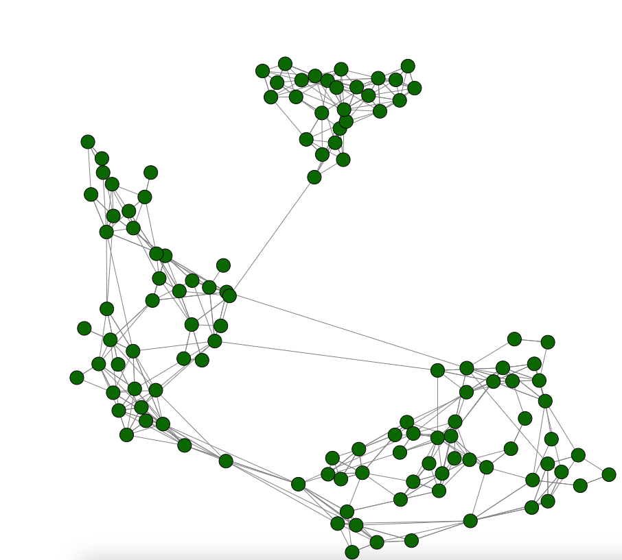
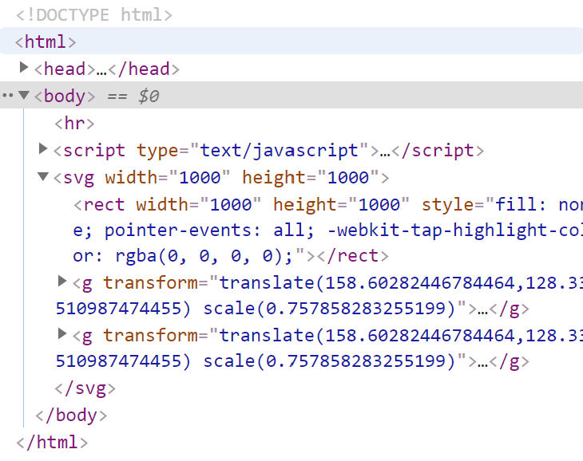
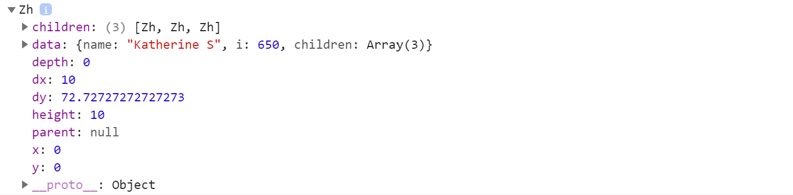
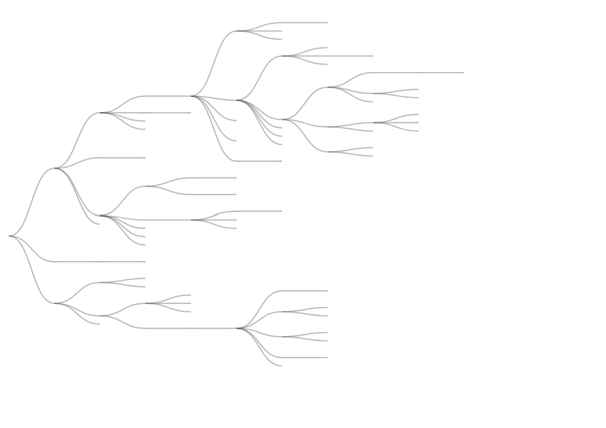
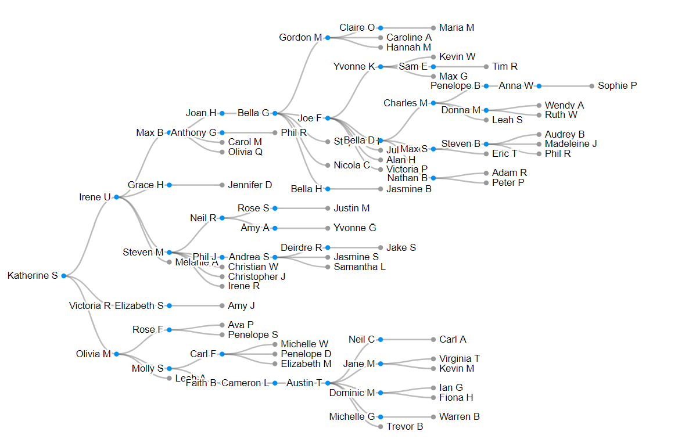
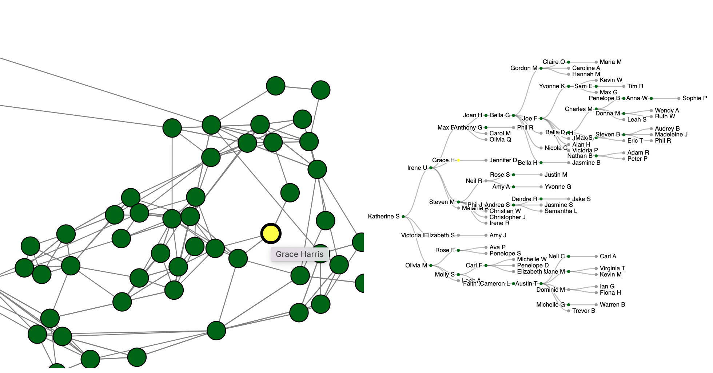

# HW 3: Implement an Interactive Network
You are going to write a visualization capable of representing node-link data. These datasets correspond to the contacts and friendship relations between students in a high school in Marseilles, France, in December 2013, as measured through several techniques.

## Preliminary Data Files:
* **Contact-diaries-network_data_2013.csv [5KB]:** This dataset corresponds to the directed network of contacts between students as reported in contact diaries collected at the end of the fourth day of the data collection. Each line has the form “i j w”, meaning that student i reported contacts with student j of aggregate durations of: 
  1. at most 5 min if w = 1
  1. between 5 and 15 min if w = 2 
  1. between 15 min and 1 h if w = 3
  1. more than 1 h if w = 4.
* **Friendship-network_data_2013.csv [6KB]:** This dataset corresponds to the directed network of reported friendships. Each line has the form “i j”, meaning that student i reported a friendship with student j.
* **metadata_2013.csv [4KB]:** This dataset contains a tab-separated list in which each line of the form “i Ci Gi” gives class Ci and gender Gi of the person having ID i. The original dataset has been augmented with gendered and gender-neutral names from [HomePage]( [https://homepage.net/name_generator/) to make them a little easier to remember and distinguish.

In this tutorial, we will only be using two of the datasets. The third is included in case you want to have a little fun with it and explore.

## Prepare the Data:

Let's start by importing [D3 JS](https://d3js.org/). This assignment is using D3 - v6 - so you can expect some changes from the previous homework.

```html
<script src="https://d3js.org/d3.v6.min.js"></script>
```

Creating force-directed layouts in D3 is not too tough, but it does mean that we need to prepare our data a certain way. We can anticipate from the files above that we will need to once again use an asynchronous loading scheme, using promise, to load multiple files. 

```javascript
Promise.all([
   d3.csv('assets/data/metadata_2013.csv'),
   d3.csv('assets/data/Contact-diaries-network_data_2013.csv')
]).then(ready);

function ready(data) {
   const nodes = data[0];
   const links = data[1];

   console.log(nodes,links);
}
```

The above code will load our two data files, and we should be able to verify from the console output that our data is being read in as objects with attribute-value pairs. The list of students in the metadata file should appear to be something like the following (these are just the first three):

```json
[
  {
    "i": "650",
    "Ci": "2BIO1",
    "Gi": "F",
    "fName": "Katherine",
    "lName": "Smith"
  },
  {
    "i": "498",
    "Ci": "2BIO1",
    "Gi": "F",
    "fName": "Jennifer",
    "lName": "Duncan"
  },
  {
    "i": "627",
    "Ci": "2BIO1",
    "Gi": "F",
    "fName": "Molly",
    "lName": "McDonald"
  }
]
```

There is not a lot of descriptive information here and the names are fake. Still, using group and rollup, we can answer some questions about the dataset directly using code. We can see that there are a few different classes for these students (the **Ci** attribute) and that each student has been assigned a gender. If we wanted to roll them up to find out the ratio present, we could do the following: 

```javascript
const rolledGender = d3.rollup(nodes, v => v.length, d => d["Gi"]);

console.log(rolledGender);
```
Which would output:

```json
[
   {
      "key": "F",
      "value": 146
   },
   {
      "key": "M",
      "value": 176
   },
   {
      "key": "Unknown",
      "value": 7
   }
]
```

We see a few more males in the sample than females but not a terribly unbalanced dataset. There are also some "Unknown" members, which we might need to think about if we are going to be using this attribute later for a visual channel. 

To get our data working in the force-directed layout, however, we are going to need to get our data into a different format (see example below from *Interactive Data Visualization for the Web, 2nd Ed.*):

```javascript
var dataset = {
    nodes: [
        { name: "Adam" },
        { name: "Bob" },
        { name: "Carrie" },
        { name: "Donovan" },
        { name: "Edward" },
        { name: "Felicity" },
        { name: "George" },
        { name: "Hannah" },
        { name: "Iris" },
        { name: "Jerry" }
    ],
    edges: [
        { source: 0, target: 1 },
        { source: 0, target: 2 },
        { source: 0, target: 3 },
        { source: 0, target: 4 },
        { source: 1, target: 5 },
        { source: 2, target: 5 },
        { source: 2, target: 5 },
        { source: 3, target: 4 },
        { source: 5, target: 8 },
        { source: 5, target: 9 },
        { source: 6, target: 7 },
        { source: 7, target: 8 },
        { source: 8, target: 9 }
    ]
};
```

In this format, there is an array of objects called `nodes` and an array of objects called `edges` (reminder: links are sometimes called edges). They each are attributes for a single `dataset` object. What is important to notice about this is the way the source and target nodes are identified in the `edges` - not by a descriptive value of the node, but by its index in the `nodes` array. So, the first edge  from source of 0 to target of 1 goes from Adam to Bob. Source index 3 refers to Donovan, the fourth element in the `nodes` list, because the counting starts at 0. 

We have a problem. Our nodes have custom IDs from the scientists who collected the data. Not all IDs in the range were used. Also, our links use the custom IDs from the nodes, not the index. Before we can do anything with this data, we have to get it into a format that D3 can more easily recognize.

There are a lot of paths we can take at this point. Take a minute - really think to yourself - how would you solve this problem? 

This was my solution. You may very well be able to come up with something better. Inspecting the data, I can see that the IDs do not start at 0. Also, there are unused elements in the range. The data is unsorted. I could, potentially, sort the data and shift all the IDs numerically into a contiguous sequence. However, I think the simplest approach is to treat the ID in the original dataset as a "name" of sorts, and let the links in the original dataset tell me which "name" is connected to which. Notice the example dataset above does not even have an id attribute for the nodes, only names. So, I need a way to look up the index for a given name. I could potentially use a hashmap here, but given the name I want to look up is numerical, I believe I can get away with an array:

```javascript
let mapping = [];
nodes.forEach((d,i) => {
    mapping[+d['i']] = i;
});

console.log(mapping);
```

Now, if I have one of the original arbitrary name IDs, I can look up the index number for the correct node in my mapping array. I can verify this - the first element in my student has an assigned ID of 650, but as the first element, I want to store the index of 0 for it in my mapping. The following code should output a 0 to console, which it does:

```javascript
console.log(mapping[+nodes[0]["i"]]);
```

Now that we have that out of the way, let us update our original links data with `source` and `target` attributes using the new indices.

```javascript
links.forEach(d => {
    d['source'] = mapping[+d["i"]];
    d['target'] = mapping[+d["j"]];
})
```

We can verify this using console output again, but one of the downsides of doing that is the output of hundreds of objects can be much more than we need. Here's a handy trick - use `.slice()` to only output a subset of an array:

```javascript
console.log(links.slice(0,5));
```
Which gives us the following: 

```json
[
   {
      "i": "3",
      "j": "28",
      "w": "2",
      "source": 157,
      "target": 146
   },
   {
      "i": "3",
      "j": "106",
      "w": "1",
      "source": 157,
      "target": 52
   },
   {
      "i": "3",
      "j": "147",
      "w": "4",
      "source": 157,
      "target": 162
   },
   {
      "i": "3",
      "j": "177",
      "w": "1",
      "source": 157,
      "target": 11
   },
   {
      "i": "3",
      "j": "295",
      "w": "4",
      "source": 157,
      "target": 49
   }
]
```

Finally, we will use the following naming of our data:

```javascript
let dataset = {
    nodes: nodes,
    edges: links
}
```

## Defining the Force Simulation:

Now that we have the basic data structure in place, we need to initialize the force simulation layout. To start, we place some initial setup code inside our script to prepare the `svg` element we will be using.

```javascript
let w = 400;
let h = 400;

//Create SVG element
let svg = d3.select("body")
        .append("svg")
        .attr("width", w)
        .attr("height", h);
```

Now, we need to initialize a simple force layout:

```javascript
//Initialize a simple force layout, using the nodes and edges in dataset
var simulation  = d3.forceSimulation(dataset.nodes)
              .force("charge", d3.forceManyBody())
              .force("link", d3.forceLink(dataset.edges))
              .force("center", d3.forceCenter().x(w/2).y(h/2));
```

By itself, `forceSimulation` does not do very much. That is why we call it with three chained calls to `force()`, each one applying a different [type of force](https://github.com/d3/d3-force/blob/master/README.md#simulation_force) that we want to be included in our simulation. These forces can be whatever you want them to be, and can be fine-tuned to achieve the affect you want. The [full list is here](https://github.com/d3/d3-force/blob/master/README.md#forces), where the description for our current three forces has been obtained and reprinted here:

- **Charge**: The many-body (or n-body) force applies mutually amongst all nodes. It can be used to simulate gravity (attraction) if the strength is positive, or electrostatic charge (repulsion) if the strength is negative. This implementation uses quadtrees and the Barnes–Hut approximation to greatly improve performance; the accuracy can be customized using the theta parameter.

    Unlike links, which only affect two linked nodes, the charge force is global: every node affects every other node, even if they are on disconnected subgraphs.
- **Link**: The link force pushes linked nodes together or apart according to the desired link distance. The strength of the force is proportional to the difference between the linked nodes’ distance and the target distance, similar to a spring force.
- **Centering**: The centering force translates nodes uniformly so that the mean position of all nodes (the center of mass if all nodes have equal weight) is at the given position ⟨x,y⟩. This force modifies the positions of nodes on each application; it does not modify velocities, as doing so would typically cause the nodes to overshoot and oscillate around the desired center. This force helps keeps nodes in the center of the viewport, and unlike the positioning force, it does not distort their relative positions.

Now, we need a way to see our nodes and links. Nothing too surprising here - we are going to create line edge marks and circle node marks. These will be added to the svg using the `enter()` join. We will set the edges as thin grey lines and the nodes as blue circles with a thin black edge. You may notice we are doing something a little different here - we are storing our nodes and edges inside `g` elements. This means that edgeMarks points to the `g` element, not the edges, so we will need to be careful when we select them. It has a big payoff later.

Just for fun, we will set the colors using a few different methods:
- named color: "grey"
- rgb: "rgb(0, 145, 242)"
- hex: "#000000"

```javascript
//Create edges as lines
let edgeMarks = svg.append("g");

edgeMarks.selectAll("line")
        .data(dataset.edges)
        .enter()
        .append("line")
        .style("stroke", "grey")
        .style("stroke-width", 1);

//Create nodes as circles
let nodeMarks = svg.append("g");

nodeMarks.selectAll("circle")
        .data(dataset.nodes)
        .enter()
        .append("circle")
        .attr("r", 10)
        .style("stroke", "#000000")
        .style("stroke-width", 1)
        .style("fill", "rgb(0, 145, 242)");
```

Getting this far will yield the following: 


That is definitely not what we want, but it is important to understand why. We have a simulation that is up and running, and svg elements for our network, but they are not connected to each other. Consequently, the default position for the elements is in the origin: x = 0 and y = 0, or in the upper-left of the svg container. The simulation is running in a series of steps, or "ticks" like a clock, and every time the simulation ticks we want the svg elements to update their position. Lines have two x,y coordinates representing the source and target endpoints; the circles have a single center x,y coordinate.

```javascript
//Every time the simulation "ticks", this will be called
simulation.on("tick", () => {
    edgeMarks.selectAll("line").attr("x1", d => { return d.source.x; })
        .attr("y1", d => { return d.source.y; })
        .attr("x2", d => { return d.target.x; })
        .attr("y2", d => { return d.target.y; });

    nodeMarks.selectAll("circle").attr("cx", d => { return d.x; })
        .attr("cy", d => { return d.y; });
});
```

Since we added the circles last, they will appear "on top" of the lines for the edges. Keep in mind, this simulation is a little bit random, so your results will appear a little different each time. The essential elements will be the same each time you refresh, but things might be moved or not quite match the image below.



Finally, if we want to see the names of our network members, we can add an on-hover tooltip with the first and last name:

```javascript
//Add a simple tooltip
nodeMarks.selectAll("circle").append("title")
    .text(d => {
      return d.fName + " " + d.lName;
    });
```

You should have a legible layout. At this point, if you like, you should feel free to play with the parameters here - what happens if you change the node radius, for instance? What if you assigned three different colors based on the gender or class of the student? What if you added a collision force, to keep the circles from overlapping? 

## Add Interactivity:

You may notice that, thanks to our centering force, most of the nodes wind up close to the middle of the layout. Many others get pushed away because they are not connected to anyone. Regardless, once the simulation stabilizes, many of the nodes may not quite be where we want them to be. But, we are stuck! We want to be able to drag them around, zoom in and out, and move around the visible area to explore the data.

The first thing we will want to add is a `call()` to our elements to let us drag them around. We need to react to drag events and respond with an event handler. Remember, in our big chain of function calls in the `append()`, we are setting up behavior for how we want the visible element of the circle marks to appear. D3 has built-in behavior code for things like drag events, but we want to make sure that our circle marks behave appropriately when the drag starts, continues, and ends.

```diff
let nodeMarks = svg.append("g");

nodeMarks.selectAll("circle")
    .data(dataset.nodes)
    .enter()
    .append("circle")
    .attr("r", 10)
    .style("stroke", "#000000")
    .style("stroke-width", 1)
    .style("fill", "rgb(0, 145, 242)")
    .call(d3.drag()
+           .on("start", dragstarted)
+           .on("drag", dragged)
+           .on("end", dragended));
```

Now, we have a bit of a choice here - we can move the circle marks directly by updating the center x and y positions; or, we can move the location of the circles in our force simulation and use our existing code to update the positions. Since our simulation is currently so tightly wed to our circle positions, let's take the latter approach.

Our three event handler function definitions are below. Each receives the event (drag event) and d for the datum that was the target. Notice this is the data element in our join, NOT the visible mark. If you inspect one of our svg circles in your browser, you will not see the attributes we are manipulating.

When the drag starts, we make a call to our simulation to restart, and set the [alphaTarget](https://github.com/d3/d3-force#simulation_alphaTarget) between the range of [0,1]. When our simulation runs, it starts off "hot" and cools down until it stabilizes into a set layout. The *alpha* is how hot the simulation is, and it decays down to zero as the movement slows down. When we restart the simulation, we are "reheating" it, and alpha is the desired temperature. Setting the value low to something like 0.1 means that the other nodes are only going to bounce around a little. Setting it to something much higher means that things will bounce around a lot.

Once the alpha target value is set, we then update the d.fx and d.fy positions. These are "fixed" positions and, if set, allow a node to be placed somewhere without getting pushed around. When the drag starts, we set the fixed position to the current position in the simulation. As the mouse is dragged, we set the fixed position to the x and y of the event (mouse pointer). When the drag event has ended, we set the fixed position to null, allowing our node to rejoin the simulation once more and springing back into its natural position. We also set the alpha target back to 0 so that it starts cooling down to that point. Something to think about - what if you wanted the node to stay exactly where you left it?

```javascript
function dragstarted(event, d) {
    if (!event.active)
        simulation.alphaTarget(0.3).restart();
    d.fx = d.x;
    d.fy = d.y;
}

function dragged(event, d) {
    d.fx = event.x;
    d.fy = event.y;
}

function dragended(event, d) {
    if (!event.active)
        simulation.alphaTarget(0);
    d.fx = null;
    d.fy = null;
}
```

Now that we have the ability to drag around our nodes, we might also want to move around a bit and explore our layout. It's fairly typical to expect that a network will allow you to pan and zoom. While a simple idea, think about the logistics. If the clicks on the background, not on any node, and drags to the left - what happens? Everything - node marks, edge marks, and any other marks in the svg - should all move exactly that many pixels to the left. If the user is moving the mouse wheel to zoom in, everything should be pushed away from the location of the mouse. If the user moves the mouse wheel to zoom out, then everything should move towards that point. The implementation details are non-trivial.

D3 makes this a little easier on us, but there are some steps we need to take. You might think that we will be registering another event listener, and you would be right. But, what do we register it on? We have nodes and links, but the rest is empty void. We will need to add a rectangle that will detect mouse movements. Where to put it in the code? Remember, we decided to add the nodes after the edges because we wanted them to be "on top". This ordering affects many things, including what catches and responds to mouse events. We want this rect to catch mouse events for pan and drag, but ignore the drag events on the node we just worked so hard on. The logical place is to therefore put this just before the edgeMarks are created and added to the svg. This rect has no fill, leaving a white background, but could potentially be given a different hue if you wanted to. Just...don't pick red. Oof.

```javascript
const zoomRect = svg.append("rect")
      .attr("width", w)
      .attr("height", h)
      .style("fill", "none")
      .style("pointer-events", "all")
```

Now that we have something to catch events, we specify how we want to handle those events. We're going to create a d3 object that defines the range we will allow the user to zoom. Put this right below our declaration of nodeMarks, not before (the reason why will become clear soon). The zoom extent defines a minimum, or smallest amount we can reduce the size of the elements in the rectangle to - 1/4 of the original size in the example below. The maximum defines the maximum amount we can increase the size, or zoom in, and is defined as multiples - 2x of the original size in the example below. Feel free to play with these once we have it working to get a better feel for how it operates. But it won't work immediately.

```javascript
const zoom = d3.zoom()
      .scaleExtent([1/4, 2])
      .on("zoom", zoomed);
```

You should notice the word `zoomed`. This is the name of our zoom handler function, which we have yet to define. We also need to define how our `zoom` object is connected to our `zoomRect`. Exactly how the code below works is...complicated. The details would require a separate series of lectures on [transforms](https://developer.mozilla.org/en-US/docs/Web/SVG/Attribute/transform), which touch on everything from fundamentals of graphics to some pretty tricky matrix arithmetic. What you need to take away is this - the position of a mark is given as a coordinates vector (x,y). Moving them in a given direction can be done by multiplying the vector and a matrix. The matrix can shift the mark in a direction - we call that a *translate transform*. The matrix can also be defined to shift the marks as though the user has zoomed in or out - we call that a *scale transform*. These matrices can be combined so that only one combo transform needs to be applied.

So, we start with the **identity** transform, which is a bit of blank slate. All later transforms will replace it. You can think of our Zoom object much like a translator. It takes the user event, mouse wheel or drag, and determines what the new transform matrix should be. So, we connect it to `zoomRect` with `call()`, so that when the user performs either of those actions within the bounds of the rect it asks the zoom object for a translation. We have already registered the zoom object to pass the resulting translation to the `zoomed` function, which takes the new transform matrix and applies it to our marks. Because of this, the code needs be placed after the marks have been declared.

```javascript
let transform = d3.zoomIdentity;

zoomRect.call(zoom);

function zoomed(event) {
    transform = event.transform;
    nodeMarks.attr("transform", transform);
    edgeMarks.attr("transform", transform);
}
```

Remember when I said that putting the elements inside `g` containers in the `svg` would have a payoff later? We are there. Instead of moving all the elements individually, we are applying our complex translate and scale operations to the two `g` elements. That's right, all the nodes move as one when the user zooms, and the same is true for links. Similarly, they all move as one when the user drags. You can verify this when you inspect the DOM in the developer toolbar. 



Getting zoom to work gets us panning for free. They are both part of the [zoom behavior](https://github.com/d3/d3-zoom/blob/v2.0.0/README.md#zoom) in `d3-zoom`. Sweet!

## Prepare a Tree:

Our node-link diagram does some things quite well! We can definitely see where the clusters are located, and who might be the important members of this network. It is easy to follow paths.

But, while the layout works nicely, it does not really help us with a few basic questions about the network. Which node has the most connections? We know this is a directed network, but currently our representation does not encode that. To do that, we are going to have to build our own data structure to represent the graph data.

We already have a good start - remember this? 

```javascript
let mapping = [];
nodes.forEach((d,i) => {
    mapping[+d['i']] = i;
});

links.forEach(d => {
    d['source'] = mapping[+d["i"]];
    d['target'] = mapping[+d["j"]];
})
```

We created an array to store the IDs, then we looped through the links to figure out the "real" index of the sources and targets. We can capitalize on these two loops to get some additional work out of them and answer our other questions about the data.

```diff
+ let graph = {};

links.forEach(d => {
    d['source'] = mapping[+d["i"]];
+    let key = +d["i"];
+    if(!(key in graph))
+       graph[key] = [];
+    let targets = graph[key];
    d['target'] = mapping[+d["j"]];
+    targets.push(+d["j"]);
})
```

This lets us do a ton of useful things. The resulting object is an associative array (as is everything, ultimately, in javascript). Each key is the id of a node, and it contains a list of all the other nodes that have a link from this node. The length of this list is the out-degree, and in the diary dataset, tells you how many people that student remembered they interacted with. If we were to put this together a little differently, we could get the in-degree, which would tell us how many people remembered interacting with our student.

A common question in these types of network is the path structure from a given node. Starting at someone, say, Katherine Smith, who is reachable and how many hops does it take? There are many path traversal algorithms, but the simplest (at least for our purpose) is breadth-first search. The result of a bfs is a tree, which we can store and visualize with `d3.hierarchy`. The description from the [online documentation](https://observablehq.com/@d3/d3-hierarchy):

> A d3.hierarchy is a nested data structure representing a tree: each node has one parent node (node.parent), except for the root; likewise, each node has one or more child nodes (node.children), except for the leaves. In addition, each node can have associated data (node.data) to store whatever additional fields you like.

Unfortunately, we cannot directly pass our data to d3.hierarchy. We have to first create our rooted tree, which means incorporating [breadth-first search](https://en.wikipedia.org/wiki/Breadth-first_search). Nothing flashy here, but we are going to use a queue and do-while loop rather than recursion. Many of you might be getting some strong CS II flashbacks right about now. We are implementing it using a named function `bfs` that returns a d3 hierarchy. Place the following code just below our `links.forEach` loop. One caveat - because we are using a d3 layout, which alters the underlying data with coordinate positions, we are going to need to first copy our data over into a new array of objects. We will also define a small `tree()` function for calling the layout and assigning the initial position of our root.

```javascript
let copies = copyNodes(nodes);
let root = bfs(copies[0], copies);
root = tree(root);
console.log(root);
function copyNodes(data){
  let copiedNodes = [];
  nodes.forEach((node,i) => {
    copiedNodes[i] = {
      name: node['fName'] + " " + node['lName'][0]
      ,
      i: +node['i']
    };
  });
  return copiedNodes;
}

function bfs(d, nodes){
  let visited = [];
  let root = d;
  let queue = [root];

  do {
    let curr = queue.shift();
    curr.children = [];
    visited.push(curr);
    let children = graph[curr['i']];
    if(children)
      children.forEach( child => {
        child = nodes[mapping[child]];
        if(!visited.includes(child) && !queue.includes(child)){
          queue.push(child);
          curr.children.push(child);
        }
      });

  } while (queue.length > 0);

  return d3.hierarchy(root);
}

function tree(root){
  root.dx = 10;
  root.dy = w / (root.height + 1);
  return d3.tree().nodeSize([root.dx, root.dy])(root);
}
```

Testing this out for Katherine Smith, our first data item, yields a tree with height 10. Because of the directed nature, there are no guarantees that everyone will be reachable from all starting nodes. For Katherine, everyone that she can reach takes 10 hops or fewer across links in the social network. Feel free to try it out with other starting nodes, and see if you get different results!



## Arrange a Tree:

We have a tree layout created, now let's take this to the DOM so that we can see it. We need to figure out just how large the range for our tree x positions is going to be. We are going to be working through the children in the root selection, finding the minimum and maximum x. Place this directly below the original `svg` declaration.

```javascript
let x0 = Infinity;
let x1 = -x0;

root.each(d => {
    if (d.x > x1) x1 = d.x;
    if (d.x < x0) x0 = d.x;
});
```

Then, we will use this information to create another svg to hold our tree so that we are not drawing our tree on top of our network. We will use the range determined above to set the `viewBox` for our SVG and give ourselves a [little flexibility](https://developer.mozilla.org/en-US/docs/Web/SVG/Attribute/viewBox) on what is shown in the window. ViewBox can also be used to pan and zoom, if we want to do that later. We are shifting the box to the left a bit to allow our first label to be entirely visible in the tree, and we are increasing the width by 120% to account for that left shift so we do not cut off elements on the right. 

```javascript
let svg2 = d3.select('body').append('svg')
    .attr("width", w)
    .attr("height", h)
    .attr("viewBox", [-50, 0, w*1.2, x1 - x0 + root.dx * 2]);
```

Now that we have a place to put our tree, let's add a g container to start putting our elements in place. We will shift the container based on the tree spacing of the root, taking into account our minimum x position from our search above.

```javascript
const g = svg2.append("g")
    .attr("font-family", "sans-serif")
    .attr("font-size", 10)
    .attr("transform", `translate(${root.dy / 3},${root.dx - x0})`);
```

As before, we want our nodes to appear on top of our links, so we will add our links to the svg first. These will be created inside their own `g` container, and we'll set them with a lower opacity to mute them a little against the background. The `data()` join will take the links generated from our root by the tree layout we constructed earlier. We are creating an svg `path` element for each link. A bit confusingly, we are populating the path's `d` [attribute](https://developer.mozilla.org/en-US/docs/Web/SVG/Attribute/d) with the commands that specify a curvy path. D3 does this for us, but if we want to know a little bit more about these [commands](https://developer.mozilla.org/en-US/docs/Web/SVG/Attribute/d#path_commands), we can inspect the first line created. It says:

- M: move to 0,0
- C: curve with the following coordinates from the current point to the endpoint 54.54545454545455,-80.78125 with the starting control point 27.272727272727273,0 and ending control point 27.272727272727273,-80.78125. These control points define how *curvy* the line is.

```html
<path d="M0,0C27.272727272727273,0,27.272727272727273,-80.78125,54.54545454545455,-80.78125"></path>
```

The code for this append is the following, which goes just below our g declaration.

```javascript
const link = g.append("g")
      .attr("fill", "none")
      .attr("stroke", "#555")
      .attr("stroke-opacity", 0.4)
      .attr("stroke-width", 1.5)
      .selectAll("path")
      .data(root.links())
      .join("path")
      .attr("d", d3.linkHorizontal()
              .x(d => d.y)
              .y(d => d.x));
```



Now we need to draw our nodes. Just below our link declaration, we are going to drop in the following code. Now, this does not cause anything new to be drawn. Instead, we are creating more `g` containers for each of our nodes. Inside these we can easily draw the node and label, and using the `translate` for the container, we can move them both at the same time if we want to move our components around dynamically. Think about this - could we take a similar approach to add labels to our force-directed diagram?

```javascript
const node = g.append("g")
    .attr("stroke-linejoin", "round")
    .attr("stroke-width", 3)
    .selectAll("g")
    .data(root.descendants())
    .join("g")
    .attr("transform", d => `translate(${d.y},${d.x})`);
```

Just below that we are going to provide a specification for our text and circles for our nodes. We are appending a circle inside the `g`, and changing up the fill depending on whether the node has children or not. If so, we use the same shade of blue as our force-directed diagram. If not, light grey. We append a text element with relative y position of `0.31em`, which is a relative measure in CSS based on the [current font height](https://www.w3schools.com/cssref/css_units.asp). As with the node, the positioning depends on whether the node has children. If so, the text is left shifted and [anchored](https://developer.mozilla.org/en-US/docs/Web/SVG/Attribute/text-anchor) to the end. If not, it is anchored the beginning of the x position, which is also shifted to the right. We also clone the element with a white stroke, which helps disambiguate the text from the lines.

```javascript
node.append("circle")
    .attr("fill", d => d.children ? "rgb(0, 145, 242)" : "#999")
    .attr("r", 2.5);

node.append("text")
    .attr("dy", "0.31em")
    .attr("x", d => d.children ? -6 : 6)
    .attr("text-anchor", d => d.children ? "end" : "start")
    .text(d => d.data.name)
    .clone(true).lower()
    .attr("stroke", "white");
```


## Add Interactivity:

With a little work, our tree could support a wide range of possible interaction options. [Expanding and collapsing](https://bl.ocks.org/d3noob/8375092) and [layout switching](https://bl.ocks.org/mbostock/e9ba78a2c1070980d1b530800ce7fa2b) are common, while simple interactions such as zoom are possible with the viewport that we added earlier. We are going to keep it relatively simple, and enhance the connection between our nodes in the tree diagram and our nodes in the force-directed network.

We start with a simple reactive highlight. When the mouse moves over the nodes in the force-directed network, they will turn yellow and be drawn with a thicker stroke. When the mouse leaves, they return to the original color. 

```diff
nodeMarks.selectAll("circle")
      .data(dataset.nodes)
      .enter()
      .append("circle")
      .attr("r", 10)
      .style("stroke", "#000000")
      .style("stroke-width", 1)
      .style("fill", "rgb(0, 145, 242)")
      .call(d3.drag()
              .on("start", dragstarted)
              .on("drag", dragged)
              .on("end", dragended))
+      .on("mouseover", function(event, d){
+          d3.select(this)
+              .style("stroke-width", 3)
+              .style("fill", "yellow");
+      })
+      .on("mouseout", function(event, d){
+          d3.select(this)
+              .style("stroke-width", 1)
+              .style("fill", "rgb(0, 145, 242)")
+      });
```

Similarly, for our nodes in the tree diagram, we will highlight them on mouseover as well. However, we will leave the stroke alone because no stroke is currently drawn. 

```diff
node.append("circle")
      .attr("fill", d => d.children ? "rgb(0, 145, 242)" : "#999")
      .attr("r", 2.5)
+      .on("mouseover", function(event, d){
+          d3.select(this)
+              .style("fill", "yellow")
+      })
+      .on("mouseout", function(event, d){
+          d3.select(this)
+              .style("fill", d => d.children ? "rgb(0, 145, 242)" : "#999")
+      });
```

Notice that, in both cases, we opted not to use the `=>` arrow notation in ES6 that we have been adopting so regularly. That is because we need to be able to readily access `this`, which refers to the current mark being drawn. The arrow does not have a binding for `this`, so it is more convenient to use the more traditional anonymous function here.

To highlight across the two, there are a few approaches we could take. We need to make a small change to the way in which our marks are created. We are going to add CSS `id` attributes to them so that we can easily grab them even from the other svg. We are giving the marks in the force-directed network an id that starts with an n followed by the id number. We are giving the marks in the tree an id that starts with an t followed by the id number.


```diff
nodeMarks.selectAll("circle")
      .data(dataset.nodes)
      .enter()
      .append("circle")
      .attr("r", 10)
+      .attr('id', d => {
+         console.log(d);
+          return 'n'+d.i;
+      })
```

```diff
node.append("circle")
      .attr("fill", d => d.children ? "rgb(0, 145, 242)" : "#999")
      .attr("r", 2.5)
+      .attr('id', d => {
+          console.log(d);
+          return 't'+d.data.i;
+      })
```

What does that give us? Well, each mark now has a unique ID that we can use to grab it from anywhere in the code. That means that, in our mouse event handlers, we can select and manipulate the tree marks from the force-directed layout and vice-versa.

```diff
node.append("circle")
    .attr("fill", d => d.children ? "rgb(0, 145, 242)" : "#999")
    .attr("r", 2.5)
    .attr('id', d => {
        console.log(d);
        return 't'+d.data.i;
    })
    .on("mouseover", function(event, d){
        d3.select(this)
            .style("fill", "yellow")
+        d3.select('#n'+d.data.i)
+            .style("fill", "yellow")
    })
    .on("mouseout", function(event, d){
        d3.select(this)
            .style("fill", d => d.children ? "rgb(0, 145, 242)" : "#999")
+        d3.select('#n'+d.data.i)
+            .style("fill", "rgb(0, 145, 242)");
    });
```

```diff
nodeMarks.selectAll("circle")
  .data(dataset.nodes)
  .enter()
  .append("circle")
  .attr("r", 10)
  .attr('id', d => {
      console.log(d);
      return 'n'+d.i;
  })
  .style("stroke", "#000000")
  .style("stroke-width", 1)
  .style("fill", "rgb(0, 145, 242)")
  .call(d3.drag()
          .on("start", dragstarted)
          .on("drag", dragged)
          .on("end", dragended))
  .on("mouseover", function(event, d){
      d3.select(this)
          .style("stroke-width", 3)
          .style("fill", "yellow");
+      d3.select('#t'+d.i)
+          .style("stroke-width", 3)
+          .style("fill", "yellow");
  })
  .on("mouseout", function(event, d){
      d3.select(this)
          .style("stroke-width", 1)
          .style("fill", "rgb(0, 145, 242)")
+      d3.select('#t'+d.i)
+          .style("stroke-width", 1)
+          .style("fill", d => d.children ? "rgb(0, 145, 242)" : "#999")
  });
```



There are so many possible directions to go from here. When you highlight a node in the tree, for example, would you highlight its children, and their children, and so on? Do you coordinate the highlighting so that you can see everything reachable from a given node in the force-link diagram? Would you use click instead of hover to allow the user to arbitrarily create a set of clicked nodes and explore them? By this point, you hopefully have some things that you might want to try, or potentially some ideas for your other projects. Best of luck!

## Where to go from Here:

For full credit on this assignment, you will need to complete the tutorial. You will not need to do anything extra to get full-credit -- the tradeoff being that this assignment introduces a lot more complexity:

1. [50%] **Visible Network**. The node-link diagram is drawn using the force-directed approach specified in the tutorial (though you can feel free to play around with the parameters or add additional forces).
1. [25%] **Interactive Network**. The user can drag nodes. The user can pan and drag the entire layout.
1. [15%] **Visible Tree**. The tidy tree layout is created as specified in the tutorial.
1. [10%] **Interactive Tree**. Hovering over any node in the tree highlights the same node in the node-link diagram and vice-versa.
1. Extra Credit [+5%]: **Customized Look** Draw the nodes in the node-link diagram differently depending on the attributes (e.g., gender, class) or network metrics (e.g., out-degree). If color is used, it should be consistent between the network and tree. You can also consider styling the edges of the node-link diagram instead: edge weight and direction are both good options for this.
1. Extra Credit [+5%]: **Tree from Network** When the user clicks on a node in the node-link diagram, the tree for that node is drawn. If a tree was already there, it is removed (e.g., with `remove()` or a potentially more elegant update-based transitions) and replaced with the new one.

For example, in the image below, the colors have been assigned using the class each student belongs to. The nodes are sized by degree and the links are sized by edge weight. On hover, only the hovered node and its out-degree adjacent nodes retain their opacity, all other nodes and edges are made somewhat transparent. A stroke has been added to the tree node circles. On click, the tree is drawn again for the selected node.


### Acknowledgements:
This assignment was adapted from an assignment designed by [Dr. Alex Godwin](https://www.jagodwin.com).

- Force arrangement adapted from https://observablehq.com/@borowski-9ld/d3-force-directed-graph
- Colors from http://colorizer.org/ and https://colorbrewer2.org
- Some material adapted from Interactive Data Visualization for the Web, 2nd Edition, by Scott Murray
- Tree layout adapted from https://observablehq.com/@d3/tidy-tree
- Dataset from http://www.sociopatterns.org/datasets/high-school-contact-and-friendship-networks/
